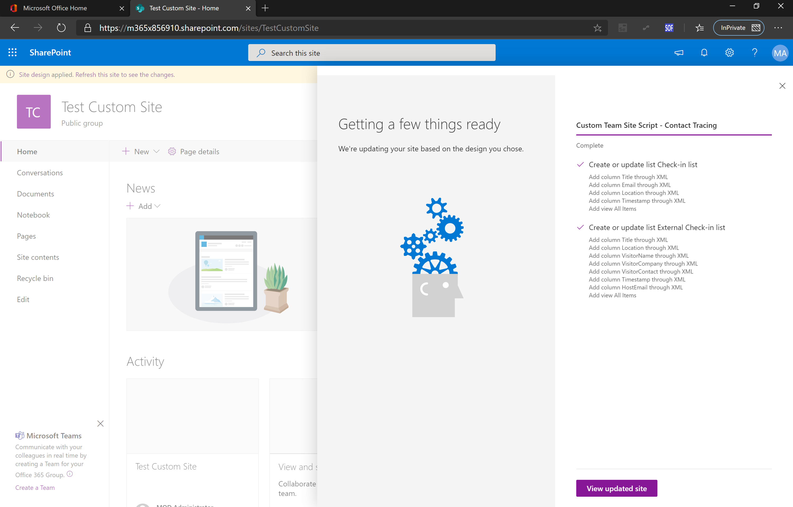
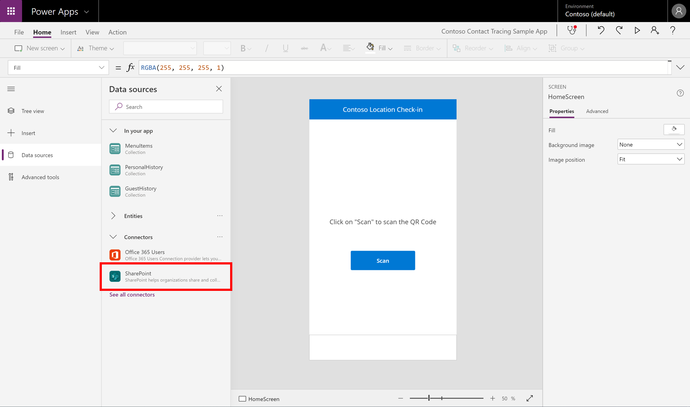
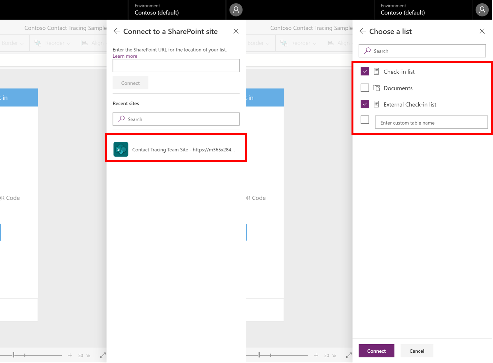
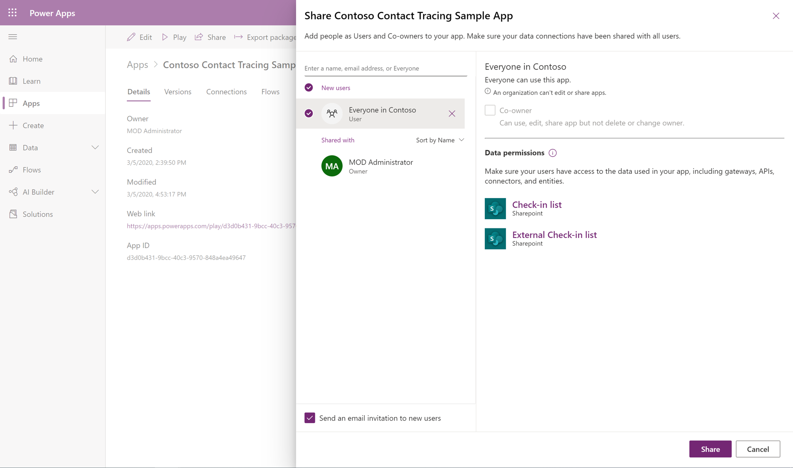

# Contact Tracing Canvas PowerApp
Contoso Organization would want their employee to log their whereabouts in the organization for the purpose of contact tracing in an event of a potential epidemics case. In addition, the employee would also need to get their visitors to provide their details as well when they are visiting. QR codes will provided for every known location within the organization. Employee will need to use an app to scan the QR code and check in. 

This scenario is adapted from the Medium Post - [Building Contact Tracing (Check-in) Canvas App using Power Apps](https://medium.com/@jenzushsu/building-contact-tracing-check-in-canvas-app-using-power-apps-5b273956de33).

Below is a high level walkthrough of this contact tracing application:

[](http://www.youtube.com/watch?v=D5FepxLDfFw"")

Below is the high level process overview of the purpose of this application:


The application flows as illustrated for the different scenarios shown in the process flow:


## Getting Started

These instructions will get you a copy of the project up and running in your PowerApps Environment. See deployment for notes on how to deploy and create connections for the relevant datasources for this application.

## Prerequisites
What licenses you need and things to install to run this sample PowerApp. 
### Licensing
1. Office 365 Licenses - Please refer to this [link](https://go.microsoft.com/fwlink/?linkid=2085130) on the qualifying licenses to use PowerApps from Office 365 licenses.
2. QR Code Generator - You can easily search for a free QR Code generator online. Example: [www.the-qr-code-generator.com](https://www.the-qrcode-generator.com/). 

### Administrative Level 
Please ensure that you have the right administrative rights to perform the following deployment tasks below.
### Windows PowerShell or SharePoint Online Management Shell
#### Microsoft SharePoint Online Services Module for Windows PowerShell
If you are using PowerShell, check that you have the [Microsoft SharePoint Online Services Module for Windows PowerShell](https://www.powershellgallery.com/packages/Microsoft.Online.SharePoint.PowerShell/16.0.19814.12000).  You can first check if you have already installed SharePoint Online Management Shell by running the following command in administrative mode in PowerShell.
```
PS> Get-Module -Name Microsoft.Online.SharePoint.PowerShell -ListAvailable | Select Name,Version
```
If your operating system is using PowerShell 5 or newer, you can install Sharepoint Online Management Shell also by running following command in administrative mode.
```
PS> Install-Module -Name Microsoft.Online.SharePoint.PowerShell
```
#### SharePoint Online Management Shell
If you are using SharePoint Online Management Shell, download and install the latest [SharePoint Online Management Shell](https://go.microsoft.com/fwlink/p/?LinkId=255251). If you already have a previous version installed, uninstall it first and then install the latest version.

For the provided PS script, it is using a username and password to connect to SharePoint. If your organziation is using Multi-Factor Authentication (MFA), refer to this [link](https://docs.microsoft.com/en-us/powershell/sharepoint/sharepoint-online/connect-sharepoint-online?view=sharepoint-ps#to-connect-with-multifactor-authentication-mfa) and modify the script accordingly.

## Deployment
Please follow the **sequence** of this deployment guide - Do not skip any steps.
### Add Custom SharePoint Site Script for SharePoint Team Siite to SharePoint Online Tenant

#### Site Design and Site Script crash course
Site design is basically a template which will be selected while creating the site and it takes care of executing the custom configurations (actions) mentioned in the site scripts. Simply, it's a pre-defined actions that get executed to a site after the site has been created. I'm using Site Design to add the desired lists with the desired columns to capture the information for this Canvas App. 

A Site Design is like a container for Site Scripts. A Site Script is a JSON string that contains the actions to be executed on the site. You can attach one or more site scripts to a site design, and all the actions defined in the scripts are executed. 

For this Contact Tracing App, there are 2 custom SharePoint Lists designed to capture information for internal staff and external visitors. I have created 2 Site Scripts for these SharePoint Lists found in [json](json) folder. Below is a sample of the JSON schema for Site Scripts used for the SPO lists:

```
{
    "$schema": "https://developer.microsoft.com/json-schemas/sp/site-design-script-actions.schema.json",
    "actions": [
        {
            "verb": "createSPList",
            "listName": "Check-in list",
            "templateType": 100,
            "subactions": [
                {
                   //all the subactions 
                }
            ]
        }
    ]
}
```
#### Steps to deploy the Site Design
1. Download the Site Scripts from [json](json) folder to your local machine.
2. Download the [ContactTracingTeamSiteSPOSiteDesignScript.ps1](ps/ContactTracingTeamSiteSPOSiteDesignScript.ps1) and open PowerShell on your local machine.
3. Check if your local machine is permitted to execute unsigned scripts from other users. Start PowerShell with the Run as Administrator option and then use the following command to find the effective execution policy on your local machine:
```
PS> Get-ExecutionPolicy
AllSigned
```
If the return value is ```AllSigned```,  use the following command to change the execution policy on the computer to RemoteSigned:
```
PS> Set-ExecutionPolicy RemoteSigned
```
4. Change the relevant variable and execute the script.
5. Login to SharePoint Online, click on "+ Create Site" and select "Team Site".
6. Under "Choose a design" option set, you should see "Contact Tracing Team Site Template" 

### Create the Custom SharePoint Team Site for Contact Tracing
#### Steps to create Custom Team Site in SharePoint Online
1. Login to SharePoint Online, click on "+ Create Site" and select "Team Site".
2. Under "Choose a design" option set, select "Contact Tracing Team Site Template".
3. Enter the Team Site information. Select "Public" for Privacy Settings as shown below. Follow through the rest of the steps and wait for the Team Site to be created.


4. You can view the progress of the site design by clicking "View Progress" on top of the screen during Team Site creation.



5. Make sure that the 2 custom SharePoint Lists - **Check-in List** and **External Check-in List** are created in this Team Site. 

### Import the PowerApps project to your PowerApps Environment
1. Download the PowerApp package from the [powerapp](powerapps/) folder to your local machine.
2. Login to [PowerApps](https://make.powerapps.com/home) and select the environment for this app.
3. Follow the [instructions](https://powerapps.microsoft.com/en-us/blog/powerapps-packaging/) on how to import the package.
4. Click "Import" after the package upload is completed. Open the new imported app.
5. In PowerApps Studio, expand the left pane and select "Data sources". Under Connectors, you should see a SharePoint Connection which may have been established previously or upon opening this app. Click on this connection as shown below.



6. Select the Team Site you created with the custom SharePoint Site Design Template. Choose the lists - **Check-in List** and **External Check-in List** and click "Connect".



7. Save this project. Test the app to make sure that the information can be captured in SharePoint Lists.
8. Once tested, publish the app and share with everyone in the organization.



### Create QR Code for location
The Barcode Scanner for this PowerApps only take in a plain text - representing the location in the organization. You can create a QR Code to embed a simple text - "Meeting Room 1". If you need any logic to parse the scanned value from QR code, you can change the logic in the **onScan** property of the barcode scanner component located in **HomeScreen**.

## Author
* **Jenzus Hsu** - [jenzushsu](https://github.com/jenzushsu)

## Disclaimer
This app is a sample and may be used with Microsoft Power Apps and SharePoint Online. You bear the sole risk and responsibility for any use of this app. The innovation and views expressed here are those of my own and do not necessarily state or reflect those of Microsoft Singapore or Microsoft Corporation.

